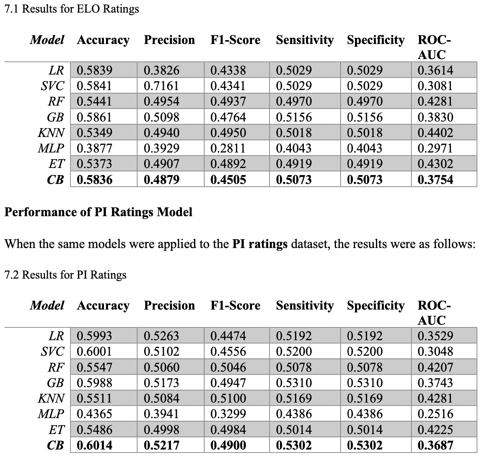

# Amitanshu's Portfolio

# [Project 1: Beyond the Scoreboard: Match Prediction using CatBoost and Pi-Ratings]
## A data analytics project 
- Developed and implemented a novel pi-rating system to dynamically assess football team performance based on match score discrepancies, ensuring adaptability and efficiency.
- Leveraged CatBoost’s advanced machine learning capabilities to analyze team ratings and match outcomes, achieving 60.14% accuracy—outperforming Logistic Regression, Random Forest, and Gradient Boosting models.
- Demonstrated consistent profitability against market odds using pi-ratings integrated with CatBoost, showcasing improved predictive strength over traditional systems
like ELO ratings
## Results:

