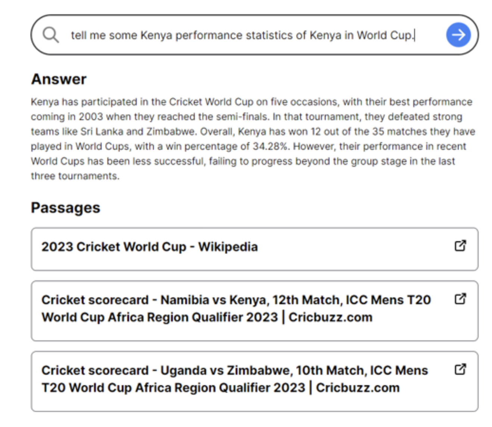

# Amitanshu's Portfolio

# [Project 1: Beyond the Scoreboard: Match Prediction using CatBoost and Pi-Ratings]
## A data analytics project 
- Developed and implemented a novel pi-rating system to dynamically assess football team performance based on match score discrepancies, ensuring adaptability and efficiency.
- Leveraged CatBoost’s advanced machine learning capabilities to analyze team ratings and match outcomes, achieving 60.14% accuracy—outperforming Logistic Regression, Random Forest, and Gradient Boosting models.
- Demonstrated consistent profitability against market odds using pi-ratings integrated with CatBoost, showcasing improved predictive strength over traditional systems
like ELO ratings
## Results:

# [Project 2: Utilizing Retrieval and Augmented Generation Algorithm and Embedding Models for Cricket World Cup 2023 Assistant]
## A Chatbot and Research Tool
- Developed an AI-powered platform utilizing Retrieval-Augmented Generation (RAG) and embedding models to process large datasets related to the Cricket World Cup. - Engineered a knowledge base by transforming data into embeddings using the text-embedding-ada-002 model and storing it in a Supabase database.
- Designed and implemented a conversational interface to allow users to query and retrieve information efficiently.
- Integrated chatbot and research functionalities, ensuring a seamless and user-friendly experience.
## User Interface:
 
